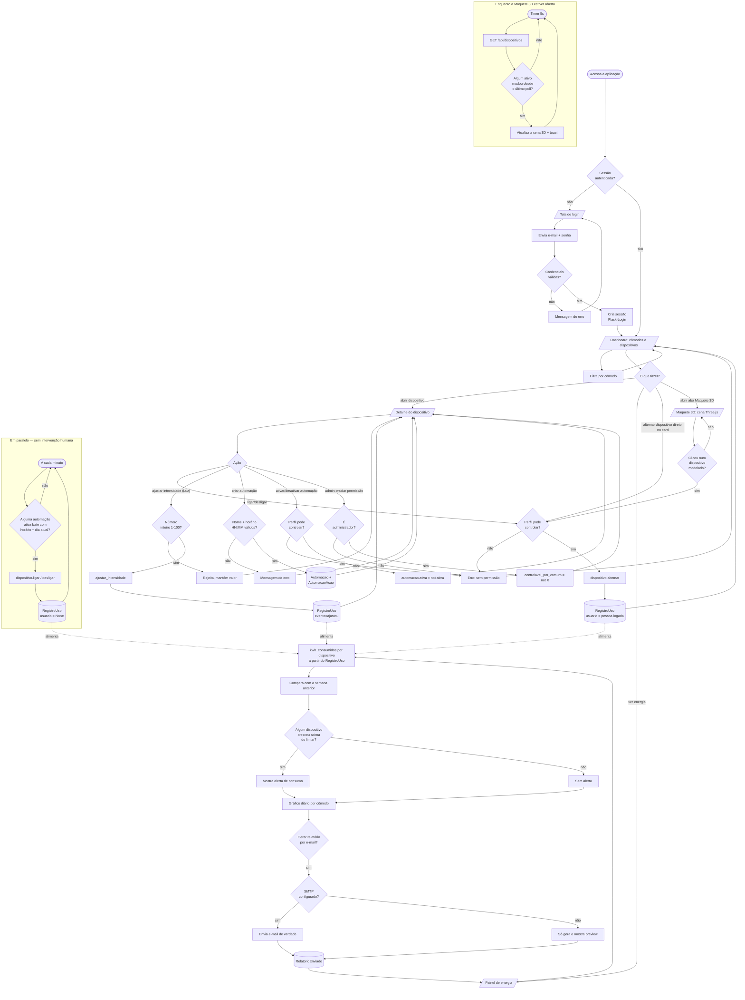

# Fluxograma da aplicação

Fluxo completo do PULSE2050, das duas entradas do sistema (uma pessoa
usando a interface, e o agendador rodando sozinho em segundo plano) até os
efeitos finais no banco de dados.

## Como ler

- **Dois pontos de entrada de dados no `RegistroUso`:** uma pessoa
  interagindo pela UI (`usuario` preenchido) ou o agendador disparando uma
  automação sozinho (`usuario = None`) — os dois alimentam o mesmo cálculo
  de energia, sem caminho especial pra automação.
- **Toda ação de controle passa por uma checagem de permissão**
  (`Dispositivo.pode_controlar()`) antes de qualquer mudança de estado —
  aparece três vezes no fluxo (alternar dispositivo, alternar automação,
  mudar permissão) porque é a mesma regra aplicada em pontos diferentes.
- **Toda entrada de formulário é validada antes de tocar no banco** —
  intensidade (dígito 1-100), horário da automação (HH:MM válido),
  credenciais de login.
- **A Maquete 3D não tem lógica própria de controle** — um clique nela cai
  no mesmo `PermToggle` que os cards usam, então a regra de permissão e o
  `RegistroUso` gerado são idênticos, só a interface é diferente. O `POLL`
  em paralelo é o que permite a maquete refletir uma automação disparando
  sozinha (ou alguém mexendo em outra aba) sem precisar recarregar a
  página — ela lê o mesmo estado que qualquer um dos três `RegistroUso`
  do fluxo principal deixou no banco.
